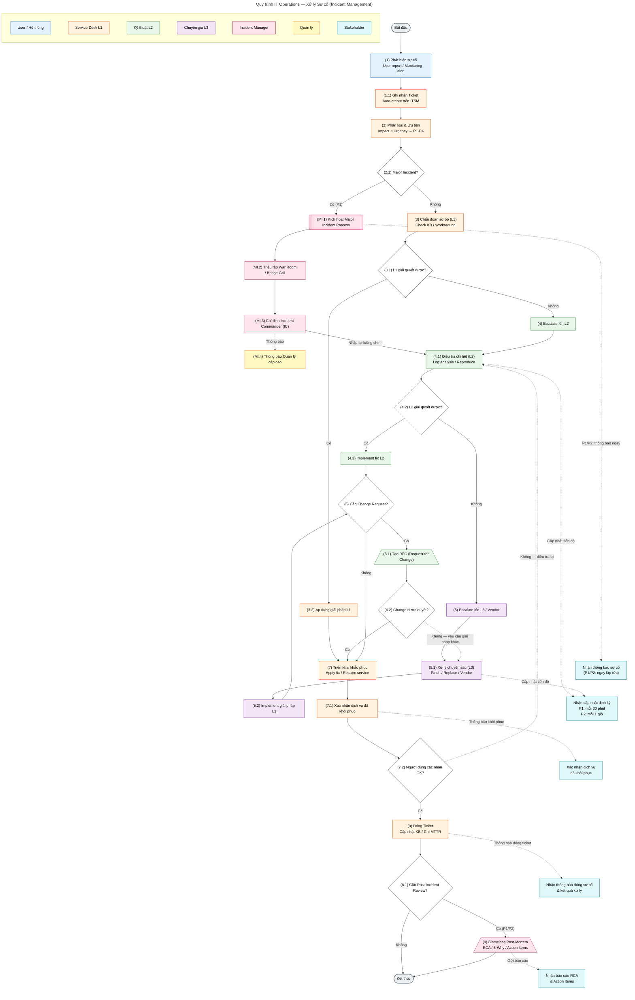

```mermaid
---
title: "Quy trình IT Operations — Xử lý Sự cố (Incident Management)"
---
flowchart TD
    %% ═══════════════════════════════════════════
    %%  STYLES
    %% ═══════════════════════════════════════════
    classDef userSys fill:#E3F2FD,stroke:#1565C0,color:#000
    classDef L1 fill:#FFF3E0,stroke:#E65100,color:#000
    classDef L2 fill:#E8F5E9,stroke:#2E7D32,color:#000
    classDef L3 fill:#F3E5F5,stroke:#6A1B9A,color:#000
    classDef incMgr fill:#FCE4EC,stroke:#AD1457,color:#000
    classDef mgmt fill:#FFF9C4,stroke:#F57F17,color:#000
    classDef stakeholder fill:#E0F7FA,stroke:#00838F,color:#000
    classDef decision fill:#FFFFFF,stroke:#000,color:#000
    classDef startEnd fill:#ECEFF1,stroke:#37474F,color:#000

    %% ═══════════════════════════════════════════
    %%  LEGEND
    %% ═══════════════════════════════════════════
    subgraph Legend[" "]
        direction LR
        LG1["User / Hệ thống"]:::userSys ~~~ LG2["Service Desk L1"]:::L1
        LG2 ~~~ LG3["Kỹ thuật L2"]:::L2
        LG3 ~~~ LG4["Chuyên gia L3"]:::L3
        LG4 ~~~ LG5["Incident Manager"]:::incMgr
        LG5 ~~~ LG6["Quản lý"]:::mgmt
        LG6 ~~~ LG7["Stakeholder"]:::stakeholder
    end

    %% ═══════════════════════════════════════════
    %%  NODES — Main Flow
    %% ═══════════════════════════════════════════

    START(["Bắt đầu"]):::startEnd

    S1["(1) Phát hiện sự cố
    User report / Monitoring alert"]:::userSys

    S1_1["(1.1) Ghi nhận Ticket
    Auto-create trên ITSM"]:::L1

    S2["(2) Phân loại & Ưu tiên
    Impact × Urgency → P1-P4"]:::L1

    D2_1{"(2.1) Major Incident?"}:::decision

    %% ── Major Incident Branch ──
    MI1[["(MI.1) Kích hoạt Major Incident Process"]]:::incMgr
    MI2["(MI.2) Triệu tập War Room / Bridge Call"]:::incMgr
    MI3["(MI.3) Chỉ định Incident Commander (IC)"]:::incMgr
    MI4["(MI.4) Thông báo Quản lý cấp cao"]:::mgmt

    %% ── Normal Flow ──
    S3["(3) Chẩn đoán sơ bộ (L1)
    Check KB / Workaround"]:::L1

    D3_1{"(3.1) L1 giải quyết được?"}:::decision

    S3_2["(3.2) Áp dụng giải pháp L1"]:::L1

    S4["(4) Escalate lên L2"]:::L2

    S4_1["(4.1) Điều tra chi tiết (L2)
    Log analysis / Reproduce"]:::L2

    D4_2{"(4.2) L2 giải quyết được?"}:::decision

    S4_3["(4.3) Implement fix L2"]:::L2

    S5["(5) Escalate lên L3 / Vendor"]:::L3

    S5_1["(5.1) Xử lý chuyên sâu (L3)
    Patch / Replace / Vendor"]:::L3

    S5_2["(5.2) Implement giải pháp L3"]:::L3

    D6{"(6) Cần Change Request?"}:::decision

    S6_1[/"(6.1) Tạo RFC (Request for Change)"\]:::L2

    D6_2{"(6.2) Change được duyệt?"}:::decision

    S7["(7) Triển khai khắc phục
    Apply fix / Restore service"]:::L1

    S7_1["(7.1) Xác nhận dịch vụ đã khôi phục"]:::L1

    D7_2{"(7.2) Người dùng xác nhận OK?"}:::decision

    S8["(8) Đóng Ticket
    Cập nhật KB / Ghi MTTR"]:::L1

    D8_1{"(8.1) Cần Post-Incident Review?"}:::decision

    S9[/"(9) Blameless Post-Mortem
    RCA / 5-Why / Action Items"\]:::incMgr

    END(["Kết thúc"]):::startEnd

    %% ═══════════════════════════════════════════
    %%  NODES — Stakeholder Lane
    %% ═══════════════════════════════════════════

    STK1["Nhận thông báo sự cố
    (P1/P2: ngay lập tức)"]:::stakeholder
    STK2["Nhận cập nhật định kỳ
    P1: mỗi 30 phút
    P2: mỗi 1 giờ"]:::stakeholder
    STK3["Xác nhận dịch vụ
    đã khôi phục"]:::stakeholder
    STK4["Nhận thông báo đóng sự cố
    & kết quả xử lý"]:::stakeholder
    STK5["Nhận báo cáo RCA
    & Action Items"]:::stakeholder

    %% ═══════════════════════════════════════════
    %%  CONNECTORS — Main Flow
    %% ═══════════════════════════════════════════

    START --> S1
    S1 --> S1_1
    S1_1 --> S2
    S2 --> D2_1

    %% Major Incident branch
    D2_1 -- "Có (P1)" --> MI1
    MI1 --> MI2
    MI2 --> MI3
    MI3 -. "Thông báo" .-> MI4
    MI3 -- "Nhập lại luồng chính" --> S4_1

    %% Normal flow
    D2_1 -- "Không" --> S3
    S3 --> D3_1

    %% L1 resolves
    D3_1 -- "Có" --> S3_2
    S3_2 --> S7

    %% L1 cannot resolve → Escalate L2
    D3_1 -- "Không" --> S4
    S4 --> S4_1
    S4_1 --> D4_2

    %% L2 resolves
    D4_2 -- "Có" --> S4_3
    S4_3 --> D6

    %% L2 cannot resolve → Escalate L3
    D4_2 -- "Không" --> S5
    S5 --> S5_1
    S5_1 --> S5_2
    S5_2 --> D6

    %% Change Request decision
    D6 -- "Có" --> S6_1
    S6_1 --> D6_2
    D6_2 -- "Có" --> S7
    D6_2 -. "Không — yêu cầu giải pháp khác" .-> S5_1
    D6 -- "Không" --> S7

    %% Deployment & verification
    S7 --> S7_1
    S7_1 --> D7_2

    D7_2 -- "Có" --> S8
    D7_2 -. "Không — điều tra lại" .-> S4_1

    %% Close & review
    S8 --> D8_1
    D8_1 -- "Có (P1/P2)" --> S9
    D8_1 -- "Không" --> END
    S9 --> END

    %% ═══════════════════════════════════════════
    %%  CONNECTORS — Stakeholder Notifications
    %% ═══════════════════════════════════════════

    %% Major Incident → Stakeholder notified immediately
    MI1 -. "P1/P2: thông báo ngay" .-> STK1

    %% During investigation/response → periodic updates
    S4_1 -. "Cập nhật tiến độ" .-> STK2
    S5_1 -. "Cập nhật tiến độ" .-> STK2

    %% Service verified → Stakeholder confirms
    S7_1 -. "Thông báo khôi phục" .-> STK3

    %% Ticket closed → Stakeholder notified
    S8 -. "Thông báo đóng ticket" .-> STK4

    %% Post-mortem → Stakeholder receives RCA
    S9 -. "Gửi báo cáo" .-> STK5

    %% Stakeholder lane internal flow (visual ordering)
    STK1 ~~~ STK2
    STK2 ~~~ STK3
    STK3 ~~~ STK4
    STK4 ~~~ STK5
```
