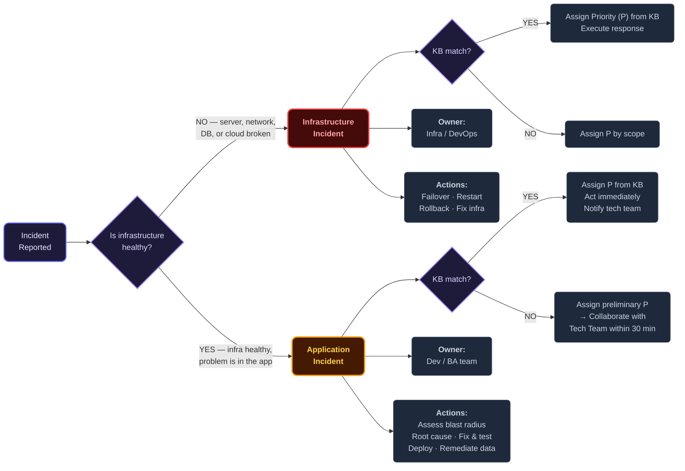
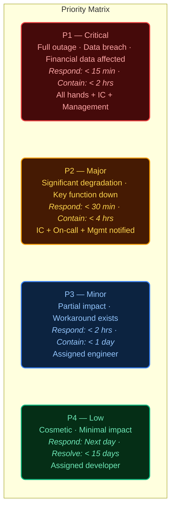

# IT Incident Management — Swimlane Flow

> Lean incident management process. Shows who does what at each stage.
> Designed for 1–2 slide presentation.
>
> Related: [`incident-triage-guideline.md`](incident-triage-guideline.md) · [`lightweight.md`](lightweight.md) · [`severity-triage.md`](severity-triage.md) · [`incident-knowledge-base.md`](incident-knowledge-base.md)

---

## Incident Classification

| Type | Definition | Owner | Examples |
|------|-----------|-------|---------|
| **Infrastructure Incident** | Platform layer is broken — servers, network, DB, cloud services. Application cannot run. | Infra / DevOps | Server crash, network outage, DB down, cloud service disruption, certificate expired |
| **Application Incident** | Infrastructure is healthy. Problem is at the application layer — crash, wrong output, logic error, design flaw. | Dev / BA team | App OOM, wrong calculation, missing info display, design flaw affecting all customers, data corruption |

**Key question**: Is infrastructure healthy? NO → Infra Incident. YES → Application Incident.

Both can be **any priority**. A silent design flaw miscalculating premiums for all customers = P1 Application Incident.

---

## Priority Matrix

| Priority | Name | Definition | Response Time | Containment | Full Resolution | Who's Involved |
|----------|------|-----------|---------------|-------------|-----------------|----------------|
| **P1** | Critical | Full outage, data breach, or financial data affected | < 15 min | < 2 hours | < 24 hours | All hands: IC + Tech + Mgmt + Comms |
| **P2** | Major | Significant degradation, key function unavailable | < 30 min | < 4 hours | < 5 business days | IC + On-call team + Mgmt notified |
| **P3** | Minor | Partial impact, workaround available | < 2 hours | < 1 business day | < 10 business days | Assigned engineer |
| **P4** | Low | Cosmetic, minimal impact | Next business day | — | < 15 business days | Assigned developer |

> **Containment** = service usable (even if degraded or feature disabled). **Full Resolution** = root cause fixed + data remediated.

---

## Swimlane Flow — Who Does What

### Slide Layout (5 Stages × 6 Roles)

> **P** = Priority level (P1–P4) as defined in the Priority Matrix above.

```
 STAGE ▸       ① DETECT         ② TRIAGE            ②b COLLABORATE       ③ RESPOND & FIX      ④ VERIFY          ⑤ CLOSE
               (< 5 min)        (< 15 min)          (App, no KB match)   (Priority-dependent)  (< 30 min)        (P1/P2: < 48 hrs)
─────────────┬────────────────┬───────────────────┬────────────────────┬──────────────────────┬─────────────────┬──────────────────
             │                │                   │                    │                      │                 │
 ANYONE      │ Report issue   │                   │                    │                      │                 │
 (User /     │ via call/chat/ │                   │                    │                      │                 │
  Alert)     │ ticket — or    │                   │                    │                      │                 │
             │ alert fires    │                   │                    │                      │                 │
             │                │                   │                    │                      │                 │
─────────────┼────────────────┼───────────────────┼────────────────────┼──────────────────────┼─────────────────┼──────────────────
             │                │                   │                    │                      │                 │
 L1/L2 ITO   │ Receive &      │ Confirm real?     │ Loop in Tech Team  │                      │                 │
 (On-call /  │ acknowledge    │ Check infra       │ + BA within 30 min │                      │                 │
  Help Desk) │                │ health            │ Share preliminary P│                      │                 │
             │ ✉ 1st: Ack     │                    │ Confirm / adjust P │                      │                 │
             │ reporter       │ NOT AN INCIDENT?  │                    │                      │                 │
             │ "Received,     │ → Route out:      │                    │                      │                 │
             │  looking       │   Service Request │                    │                      │                 │
             │  into it"      │   / User error    │                    │                      │                 │
             │                │   / Backlog       │                    │                      │                 │
             │                │   Notify reporter │                    │                      │                 │
             │                │   & close ticket  │                    │                      │                 │
             │                │                   │                    │                      │                 │
             │                │ IS AN INCIDENT:   │                    │                      │                 │
             │                │ ⏱ Log INC-xxxx    │                    │                      │                 │
             │                │ (SLA clock starts)│                    │                      │                 │
             │                │                   │                    │                      │                 │
             │                │ Classify: Infra   │                    │                      │                 │
             │                │ or Application?   │                    │                      │                 │
             │                │                   │                    │                      │                 │
             │                │ ✉ 2nd: Notify     │                    │                      │                 │
             │                │ reporter of P &   │                    │                      │                 │
             │                │ expected timeline  │                    │                      │                 │
             │                │                   │                    │                      │                 │
             │                │ Check Knowledge   │                    │                      │                 │
             │                │ Base for known    │                    │                      │                 │
             │                │ scenarios         │                    │                      │                 │
             │                │                   │                    │                      │                 │
             │                │ KB MATCH:         │                    │                      │                 │
             │                │ → Assign priority │                    │                      │                 │
             │                │   (P) from KB     │                    │                      │                 │
             │                │ → Execute first   │                    │                      │                 │
             │                │   response        │                    │                      │                 │
             │                │ → App: notify     │                    │                      │                 │
             │                │   tech team       │                    │                      │                 │
             │                │   (don't wait)    │                    │                      │                 │
             │                │                   │                    │                      │                 │
             │                │ KB NO MATCH:      │                    │                      │                 │
             │                │ → Infra: assign P │                    │                      │                 │
             │                │   by scope        │                    │                      │                 │
             │                │ → App: assign     │                    │                      │                 │
             │                │   preliminary P   │                    │                      │                 │
             │                │                   │                    │                      │                 │
─────────────┼────────────────┼───────────────────┼────────────────────┼──────────────────────┼─────────────────┼──────────────────
             │                │                   │                    │                      │                 │
 INCIDENT    │                │ Assigned as IC    │                    │ Coordinate team      │ Confirm service │ Lead RCA
 COMMANDER   │                │ (P1/P2 only)      │                    │ Manage comms         │ restored        │ Publish report
 (IC)        │                │                   │                    │ Decide: rollback?    │                 │ Track actions
             │                │                   │                    │   escalate? war room?│                 │ Update Knowledge
             │                │                   │                    │ Status updates       │                 │ Base
             │                │                   │                    │ (P1: 30m · P2: 1hr)  │                 │
             │                │                   │                    │ ✉ During: Include    │ ✉ Last: Notify  │
             │                │                   │                    │ reporter in updates  │ reporter —      │
             │                │                   │                    │                      │ "Resolved, you  │
             │                │                   │                    │                      │  can resume"    │
             │                │                   │                    │                      │                 │
─────────────┼────────────────┼───────────────────┼────────────────────┼──────────────────────┼─────────────────┼──────────────────
             │                │                   │                    │                      │                 │
 TECH TEAM   │                │                   │ App Incident:      │ INFRA INCIDENT:      │ Monitor 15 min  │ Contribute to
 (Dev /      │                │                   │ Assess blast       │  → Rollback/restart/ │ for regression  │ RCA findings
  Infra /    │                │                   │ radius with L1     │    failover          │                 │
  BA / DBA)  │                │                   │ Confirm or adjust  │  → Apply infra fix   │                 │
             │                │                   │ priority           │                      │                 │
             │                │                   │                    │ APP INCIDENT:        │                 │
             │                │                   │                    │  → Root cause        │                 │
             │                │                   │                    │  → Develop & test fix│                 │
             │                │                   │                    │  → Deploy via CI/CD  │                 │
             │                │                   │                    │  → Remediate bad data│                 │
             │                │                   │                    │                      │                 │
─────────────┼────────────────┼───────────────────┼────────────────────┼──────────────────────┼─────────────────┼──────────────────
             │                │                   │                    │                      │                 │
 QA          │                │                   │                    │ Validate fix in      │                 │
             │                │                   │                    │ staging before deploy│                 │
             │                │                   │                    │ (App Incident only)  │                 │
             │                │                   │                    │                      │                 │
─────────────┼────────────────┼───────────────────┼────────────────────┼──────────────────────┼─────────────────┼──────────────────
             │                │                   │                    │                      │                 │
 MANAGEMENT  │                │ Notified          │                    │ Receive status       │ Notified of     │ Review RCA
 (IT Mgr /   │                │ (P1/P2)           │                    │ updates              │ restoration     │ Sign off
  CTO)       │                │ Approve           │                    │ (P1: every 30 min,   │                 │ action items
             │                │ escalation        │                    │  P2: every 1 hr)     │                 │
             │                │                   │                    │                      │                 │
─────────────┴────────────────┴───────────────────┴────────────────────┴──────────────────────┴─────────────────┴──────────────────
```

> **P3/P4 note:** No Incident Commander assigned. Details below.

### P3/P4 Handling — The Bulk of Daily Work

Most incidents are P3/P4. The full IC / war-room machinery doesn't apply, but they still need structure — otherwise tickets rot or the team over-invests treating every cosmetic bug like a crisis.

| Aspect | P3 — Minor | P4 — Low |
|--------|------------|----------|
| **Coordinator** | Senior L1 or team lead | Assigned engineer (self-managed) |
| **Triage** | Same flow: classify → KB check → assign P | Same flow, lower urgency |
| **Response window** | Business hours, assigned engineer starts within 2 hours | Next business day |
| **Reporter updates** | At triage + resolution. On request in between. | At triage + resolution only. |
| **Post-incident review** | Simplified note in ticket (due within 5 business days): what broke, what fixed it, any follow-up needed. | Not required unless recurs 3+ times. |
| **Escalate to full RCA** | If financial/data impact found, or same incident recurs 3+ times. | Same trigger. |
| **KB update** | Add to Knowledge Base if likely to recur. | Only if a pattern emerges across multiple tickets. |

> **P3/P4 do NOT get:**
> - An Incident Commander
> - A war room or bridge call
> - Periodic status updates (only on-demand)
> - Management notification (unless escalated)
> - A formal RCA (unless triggered by financial/data impact or recurrence)

### When Does the Incident Start? (⏱)

The **SLA clock starts at Triage**, when L1 confirms "this is a real incident" and logs `INC-xxxx` — not when the report is received.

| Moment | What happens | SLA clock |
|--------|-------------|-----------|
| User reports / alert fires | L1 receives, acknowledges reporter (✉ 1st) | Not started |
| L1 confirms: **not an incident** | Route to service request / user error / backlog. Notify reporter. Close. | N/A |
| L1 confirms: **is an incident** | Log `INC-xxxx`. Classify. Assign priority. ✉ 2nd notification. | **Starts here** |

> **Confirmation must happen within the Detect window (< 5 min for alerts, < 15 min for user reports).** This prevents gaming — L1 cannot delay confirmation to buy time on the SLA.

### Reporter Notification Sequence (✉)

| # | Stage | Who Sends | Message | Channel |
|---|-------|-----------|---------|---------|
| **1st** | ① Detect | L1/L2 | "Received, we're on it" | Same channel as report (call/chat/ticket) |
| **2nd** | ② Triage | L1/L2 | "Classified as P__, target resolution: __" | Ticket update |
| **During** | ③ Respond | IC / Team Lead | Include reporter in periodic status updates | Ticket update / chat |
| **Last** | ④ Verify | IC / Team Lead | "Resolved, you can resume normal work" | Ticket update + direct notify |

> For P3/P4 (no IC): team lead or assigned engineer handles all reporter notifications.

---

## RACI Matrix

| Stage | L1/L2 ITO | Incident Commander | Tech Team | QA | Management |
|-------|-----------|-------------------|-----------|-----|------------|
| ① Detect | **R** | I | I | — | — |
| ② Triage | **R/A** | **A** (P1/P2) | **C** | — | **I** (P1/P2) |
| ②b Collaborate (App, no KB match) | **R** | I | **R/A** | — | — |
| ③ Respond & Fix | I | **A** (P1/P2) | **R** | **R** (App Incident) | **I** |
| ④ Verify | I | **A** | **R** | — | **I** |
| ⑤ Close (RCA) | — | **R** | **C** | — | **A** |

> **R** = Responsible · **A** = Accountable · **C** = Consulted · **I** = Informed
>
> For P3/P4: senior L1 or team lead assumes IC accountability. No formal IC role assigned. See "P3/P4 Handling" section for details.

---

## Quick Reference — Infrastructure vs Application Incident

| | Infrastructure Incident | Application Incident |
|---|---|---|
| **Infra health** | Broken | Healthy |
| **Problem layer** | Server, network, DB, cloud | App code, logic, design, config, data |
| **Priority assignment** | KB match → assign priority (P) from KB. No match → assign P by scope. | KB match → assign P from KB, act immediately, notify tech team. No match → preliminary priority → Tech Team confirms within 30 min. |
| **Response** | Restore immediately (rollback, restart, failover) | Assess blast radius → fix correctly → remediate data |
| **Owner** | Infra / DevOps | Dev / BA team |
| **Detection** | Loud — monitoring catches it | Often quiet — detected by people, not alerts |
| **RCA trigger** | Always for P1/P2 | Always for P1/P2 + if financial/data impact |

---

## Mermaid Diagrams

### Main Flow — Incident Management Process

```mermaid
flowchart TD
    %% ═══════════════════════════════════════
    %% STAGE 1: DETECT
    %% ═══════════════════════════════════════
    subgraph S1["① DETECT  •  < 5 min"]
        direction TB
        A1["Monitoring alert fires"]
        A2["User / stakeholder reports"]
        A3["Health check fails"]
    end

    %% ═══════════════════════════════════════
    %% STAGE 2: TRIAGE (includes KB check & priority assignment)
    %% ═══════════════════════════════════════
    subgraph S2["② TRIAGE  •  < 15 min"]
        direction TB
        B1["<b>L1/L2 ITO</b><br/>Confirm: is this a real incident?"]
        B_REAL{"Real incident?"}
        B_EXIT["<b>NOT AN INCIDENT</b><br/>Route to: Service Request<br/>/ User error / Backlog<br/>Notify reporter & close"]
        B2["<b>L1/L2 ITO</b><br/>⏱ Log INC-xxxx (SLA clock starts)<br/>Classify: Is infra healthy?"]
        FORK{"Infra healthy?"}
        KB_I{"Check KB<br/>Match found?"}
        KB_A{"Check KB<br/>Match found?"}
        T_I_KB["<b>L1</b> assigns P from KB<br/>Execute documented response"]
        T_I_NK["<b>L1</b> assigns P by scope"]
        T_A_KB["<b>L1</b> assigns P from KB<br/>Execute first response<br/>Notify tech team (don't wait)"]
        T_A_NK["<b>L1</b> assigns preliminary P"]

        B1 --> B_REAL
        B_REAL -->|"NO"| B_EXIT
        B_REAL -->|"YES"| B2
        B2 --> FORK
        FORK -->|"NO — infra broken"| KB_I
        FORK -->|"YES — infra healthy"| KB_A
        KB_I -->|"YES"| T_I_KB
        KB_I -->|"NO"| T_I_NK
        KB_A -->|"YES"| T_A_KB
        KB_A -->|"NO"| T_A_NK
    end

    A1 --> B1
    A2 --> B1
    A3 --> B1

    %% ═══════════════════════════════════════
    %% INFRA INCIDENT — RESPOND
    %% ═══════════════════════════════════════
    subgraph S3A["③ RESPOND — Infrastructure Incident"]
        direction TB
        C1["<b>IC</b> · P1/P2 only<br/>Coordinate · Decide: rollback?<br/>escalate? war room?<br/>Status updates (P1: 30m · P2: 1hr)"]
        C2["<b>Infra / DevOps</b><br/>Rollback / Restart / Failover"]
        C3["<b>Infra / DevOps</b><br/>Apply infrastructure fix"]
        C1 --> C2 --> C3
    end

    T_I_KB --> C1
    T_I_NK --> C1

    %% ═══════════════════════════════════════
    %% APP INCIDENT — COLLABORATE (no KB match only)
    %% ═══════════════════════════════════════
    subgraph S2B["②b COLLABORATE — App, no KB match  •  < 30 min"]
        direction TB
        D0B["<b>L1 + Tech Team + BA</b><br/>Assess blast radius<br/>Confirm / adjust priority"]
    end

    T_A_NK --> D0B

    %% ═══════════════════════════════════════
    %% APP INCIDENT — RESPOND
    %% ═══════════════════════════════════════
    subgraph S3B["③ RESPOND — Application Incident"]
        direction TB
        D1["<b>IC</b> · P1/P2 only<br/>Coordinate · Decide: rollback?<br/>escalate? war room?<br/>Status updates (P1: 30m · P2: 1hr)"]
        D2["<b>Dev Team</b><br/>Root cause & develop fix"]
        D3["<b>QA</b><br/>Validate fix in staging"]
        D4["<b>Dev / DBA</b><br/>Deploy & remediate data"]
        D1 --> D2 --> D3 --> D4
    end

    T_A_KB --> D1
    D0B --> D1

    %% ═══════════════════════════════════════
    %% STAGE 4: VERIFY
    %% ═══════════════════════════════════════
    subgraph S4["④ VERIFY  •  < 30 min"]
        direction TB
        E1["<b>Tech Team</b><br/>Monitor 15 min for regression"]
        E3["<b>IC / Team Lead</b><br/>Confirm service restored"]
        E1 --> E3
    end

    C3 --> E1
    D4 --> E1

    %% ═══════════════════════════════════════
    %% STAGE 5: CLOSE
    %% ═══════════════════════════════════════
    subgraph S5["⑤ CLOSE  •  P1/P2: within 48 hrs"]
        direction TB
        F1["<b>IC / Team Lead</b><br/>Lead blameless RCA<br/><i>(P3/P4: simplified review only)</i>"]
        F2["<b>Tech Team</b><br/>Identify root cause"]
        F3["<b>IC / Team Lead</b><br/>Define action items<br/>Update Knowledge Base"]
        F5["<b>Management</b><br/>Review & sign off<br/><i>(P1/P2 only)</i>"]
        F6["<b>INCIDENT CLOSED</b><br/>RCA published · Actions in backlog<br/>Knowledge Base updated"]
        F1 --> F2 --> F3 --> F5 --> F6
    end

    E3 --> F1

    %% ═══════════════════════════════════════
    %% MANAGEMENT — parallel track
    %% ═══════════════════════════════════════
    MGT["<b>Management</b><br/>Notified at triage (P1/P2)<br/>Approve escalation<br/>Receive status updates"]

    FORK -. "P1/P2 identified →<br/>notify Management" .-> MGT
    C1 -. "P1/P2<br/>status updates" .-> MGT
    D1 -. "P1/P2<br/>status updates" .-> MGT
    E3 -. "all-clear" .-> MGT

    %% ═══════════════════════════════════════
    %% STYLES
    %% ═══════════════════════════════════════
    classDef stageDetect fill:#1E293B,stroke:#6366F1,stroke-width:2px,color:#E2E8F0
    classDef stageTriage fill:#1E293B,stroke:#8B5CF6,stroke-width:2px,color:#E2E8F0
    classDef stageInfra fill:#1C1917,stroke:#EF4444,stroke-width:2px,color:#FCA5A5
    classDef stageApp fill:#1C1917,stroke:#F59E0B,stroke-width:2px,color:#FDE68A
    classDef stageCollab fill:#1C1917,stroke:#F59E0B,stroke-width:1.5px,color:#FDE68A
    classDef stageVerify fill:#1E293B,stroke:#10B981,stroke-width:2px,color:#A7F3D0
    classDef stageClose fill:#1E293B,stroke:#0EA5E9,stroke-width:2px,color:#BAE6FD
    classDef forkNode fill:#1E1B3A,stroke:#A78BFA,stroke-width:2.5px,color:#DDD6FE
    classDef mgtNode fill:#0C2340,stroke:#0EA5E9,stroke-width:1.5px,color:#BAE6FD,rx:8
    classDef doneNode fill:#052E16,stroke:#22C55E,stroke-width:2.5px,color:#BBF7D0,rx:12
    classDef exitNode fill:#1C1917,stroke:#6B7280,stroke-width:2px,color:#9CA3AF,rx:8

    class S1 stageDetect
    class S2 stageTriage
    class S3A stageInfra
    class S2B stageCollab
    class S3B stageApp
    class S4 stageVerify
    class S5 stageClose
    class FORK,KB_I,KB_A,B_REAL forkNode
    class MGT mgtNode
    class F6 doneNode
    class B_EXIT exitNode
```



### Incident Classification Decision



### Priority Levels



---

## PPT Design Notes

- **Slide 1**: Swimlane flow. Horizontal lanes per role, left-to-right stages. Infra Incident path (red) vs Application Incident path (amber). Note the collaboration step (②b) in the App path.
- **Slide 2**: Priority matrix (color-coded) + RACI grid + Quick Reference comparison.
- **Colors**: P1 = Red, P2 = Orange, P3 = Blue, P4 = Green.
- **Font**: 14pt minimum for readability.
