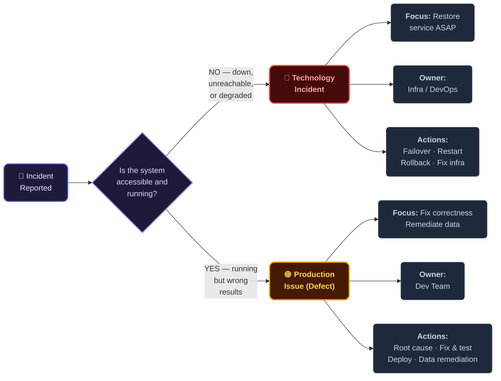
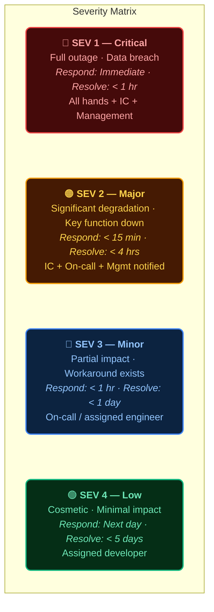

# IT Incident Management — Swimlane Flow

> Lean ITIL-aligned incident management process.
> Designed for 1–2 slide presentation. Shows who does what at each stage.
>
> Related: [`lightweight.md`](lightweight.md) (detailed flowchart) · [`severity-triage.md`](severity-triage.md) (decision tree)

---

## Incident Classification

| Category | Definition | Examples | Trigger |
|----------|-----------|----------|---------|
| **Technology Incident** | An unplanned interruption or degradation of an IT service. The system is **down, unreachable, or performing below acceptable thresholds**. Focus: **restore service ASAP**. | Server/network outage, database crash, SSL cert expiry, infrastructure failure, cloud service disruption | Monitoring alert, user unable to access system, health check failure |
| **Production Issue (Defect)** | The system is **running but producing incorrect results** — a bug or defect in production. Data integrity or business logic is wrong. Focus: **fix the defect, remediate bad data**. | Wrong premium calculation, incorrect policy status, failed batch with wrong output, integration sending malformed messages | User report, QA finding, data reconciliation mismatch, business metric anomaly |

**Key Difference**: Technology Incident = **service availability** problem. Production Issue = **correctness** problem.

---

## Severity Matrix

| Severity | Name | Definition | Response Time | Resolution Target | Who's Involved |
|----------|------|-----------|---------------|-------------------|----------------|
| **SEV 1** | Critical | Full service outage or data breach affecting customers | Immediate | < 1 hour | All hands: IC + Tech + Mgmt + Comms |
| **SEV 2** | Major | Significant degradation, key function unavailable | < 15 min | < 4 hours | IC + On-call team + Mgmt notified |
| **SEV 3** | Minor | Partial impact, workaround available | < 1 hour | < 1 business day | On-call / assigned team |
| **SEV 4** | Low | Cosmetic, minimal impact | Next business day | < 5 business days | Assigned developer |

---

## Swimlane Flow — Who Does What

### Slide Layout (5 Stages × 6 Roles)

```
 STAGE ▸       ① DETECT         ② TRIAGE          ③ RESPOND & FIX      ④ VERIFY          ⑤ CLOSE
               (< 5 min)        (< 15 min)        (SEV-dependent)      (< 30 min)        (< 48 hrs)
─────────────┬────────────────┬─────────────────┬──────────────────────┬─────────────────┬──────────────────
             │                │                 │                      │                 │
 ANYONE      │ Report issue   │                 │                      │                 │
 (User /     │ via channel    │                 │                      │                 │
  Alert)     │ or alert fires │                 │                      │                 │
             │                │                 │                      │                 │
─────────────┼────────────────┼─────────────────┼──────────────────────┼─────────────────┼──────────────────
             │                │                 │                      │                 │
 L1 SUPPORT  │ Receive &      │ Confirm real?   │                      │                 │
 (On-call /  │ acknowledge    │ Classify:       │                      │                 │
  Help Desk) │                │  Tech Incident  │                      │                 │
             │                │  or Prod Issue? │                      │                 │
             │                │ Assign SEV 1–4  │                      │                 │
             │                │                 │                      │                 │
─────────────┼────────────────┼─────────────────┼──────────────────────┼─────────────────┼──────────────────
             │                │                 │                      │                 │
 INCIDENT    │                │ Assigned as IC  │ Coordinate team      │ Confirm service │ Lead RCA meeting
 COMMANDER   │                │ (SEV1/2 only)   │ Manage comms         │ restored or fix │ Publish report
 (IC)        │                │                 │ Decide: rollback?    │ deployed        │ Track action
             │                │                 │   escalate? war room?│                 │ items
             │                │                 │                      │                 │
─────────────┼────────────────┼─────────────────┼──────────────────────┼─────────────────┼──────────────────
             │                │                 │                      │                 │
 TECH TEAM   │                │ Provide initial │ TECH INCIDENT:       │ Monitor 15 min  │ Contribute to
 (Dev /      │                │ assessment      │  → Rollback/restart/ │ for regression  │ RCA findings
  Infra /    │                │                 │    failover          │                 │
  DBA)       │                │                 │  → Apply infra fix   │                 │
             │                │                 │                      │                 │
             │                │                 │ PROD ISSUE:          │                 │
             │                │                 │  → Root cause        │                 │
             │                │                 │  → Develop & test fix│                 │
             │                │                 │  → Deploy via CI/CD  │                 │
             │                │                 │  → Remediate bad data│                 │
             │                │                 │                      │                 │
─────────────┼────────────────┼─────────────────┼──────────────────────┼─────────────────┼──────────────────
             │                │                 │                      │                 │
 QA          │                │                 │                      │ Validate fix in │ Verify no
             │                │                 │                      │ staging (Prod   │ regression
             │                │                 │                      │ Issue only)     │
             │                │                 │                      │                 │
─────────────┼────────────────┼─────────────────┼──────────────────────┼─────────────────┼──────────────────
             │                │                 │                      │                 │
 MANAGEMENT  │                │ Notified        │ Receive status       │ Approve service │ Review RCA
 (IT Mgr /   │                │ (SEV1/2)        │ updates              │ restoration     │ Sign off
  CTO)       │                │ Approve         │ (SEV1: every 30 min, │                 │ action items
             │                │ escalation      │  SEV2: every 1 hr)   │                 │
             │                │                 │                      │                 │
─────────────┴────────────────┴─────────────────┴──────────────────────┴─────────────────┴──────────────────
```

---

## RACI Matrix

| Stage | L1 Support | Incident Commander | Tech Team | QA | Management |
|-------|-----------|-------------------|-----------|-----|------------|
| ① Detect | **R** | I | I | — | — |
| ② Triage | **R/A** | **A** (SEV1/2) | **C** | — | **I** (SEV1/2) |
| ③ Respond & Fix | I | **A** | **R** | **R** (Prod Issue) | **I** |
| ④ Verify | I | **A** | **R** | **R** | **I** |
| ⑤ Close (RCA) | — | **R** | **C** | **C** | **A** |

> **R** = Responsible (does the work) · **A** = Accountable (owns the outcome) · **C** = Consulted · **I** = Informed

---

## Quick Reference — Technology Incident vs Production Issue

| | Technology Incident | Production Issue (Defect) |
|---|---|---|
| **System state** | Down or degraded | Running but incorrect |
| **Priority** | Restore service availability | Fix correctness, remediate data |
| **Typical actions** | Failover, restart, rollback, maintenance mode | Reproduce, root cause, fix, test, deploy, data remediation |
| **Typical owner** | Infra / DevOps | Dev team |
| **RCA trigger** | Always for SEV1/2 | Always for SEV1/2 + if financial/data impact |
| **Data remediation** | Rarely needed | Often needed |

---

## Mermaid Diagrams

### Main Flow — Incident Management Process

```mermaid
flowchart TD
    %% ═══════════════════════════════════════
    %% STAGE 1: DETECT
    %% ═══════════════════════════════════════
    subgraph S1["① DETECT  •  Target: < 5 min"]
        direction TB
        A1["🔔 Monitoring alert fires"]
        A2["👤 User / stakeholder reports"]
        A3["💓 Health check fails"]
    end

    %% ═══════════════════════════════════════
    %% STAGE 2: TRIAGE
    %% ═══════════════════════════════════════
    subgraph S2["② TRIAGE  •  Target: < 15 min"]
        direction TB
        B1["<b>L1 Support</b><br/>Confirm incident is real"]
        B2["<b>L1 Support</b><br/>Assign severity SEV 1–4"]
        B3["<b>L1 Support</b><br/>Classify type"]
        B1 --> B2 --> B3
    end

    A1 --> B1
    A2 --> B1
    A3 --> B1

    B3 --> FORK{"What type?"}

    %% ═══════════════════════════════════════
    %% STAGE 3a: TECH INCIDENT PATH
    %% ═══════════════════════════════════════
    subgraph S3A["③ RESPOND — Technology Incident"]
        direction TB
        C1["<b>Incident Commander</b><br/>Activate war room<br/>Coordinate response"]
        C2["<b>Tech Team — Infra/DevOps</b><br/>Rollback / Restart / Failover"]
        C3["<b>Tech Team — Infra/DevOps</b><br/>Apply infrastructure fix"]
        C4["<b>IC</b><br/>Send status updates<br/>SEV1: 30 min · SEV2: 1 hr"]
        C1 --> C2 --> C3
        C1 --> C4
    end

    %% ═══════════════════════════════════════
    %% STAGE 3b: PRODUCTION ISSUE PATH
    %% ═══════════════════════════════════════
    subgraph S3B["③ RESPOND — Production Issue"]
        direction TB
        D1["<b>Incident Commander</b><br/>Coordinate response<br/>Manage communications"]
        D2["<b>Tech Team — Dev</b><br/>Reproduce & root cause"]
        D3["<b>Tech Team — Dev</b><br/>Develop fix + tests"]
        D4["<b>QA</b><br/>Validate fix in staging"]
        D5["<b>Tech Team — Dev/DBA</b><br/>Deploy & remediate data"]
        D1 --> D2 --> D3 --> D4 --> D5
    end

    FORK -->|"System DOWN<br/>or unreachable"| C1
    FORK -->|"System UP but<br/>producing wrong results"| D1

    %% ═══════════════════════════════════════
    %% STAGE 4: VERIFY
    %% ═══════════════════════════════════════
    subgraph S4["④ VERIFY  •  Target: < 30 min"]
        direction TB
        E1["<b>Tech Team</b><br/>Monitor 15 min for regression"]
        E2["<b>QA</b><br/>Confirm fix correctness"]
        E3["<b>IC</b><br/>Confirm service restored"]
        E1 --> E3
        E2 --> E3
    end

    C3 --> E1
    D5 --> E1
    D5 --> E2

    %% ═══════════════════════════════════════
    %% STAGE 5: CLOSE
    %% ═══════════════════════════════════════
    subgraph S5["⑤ CLOSE  •  Within 48 hrs"]
        direction TB
        F1["<b>IC</b><br/>Lead blameless RCA meeting"]
        F2["<b>Tech Team</b><br/>Build timeline &<br/>identify root cause"]
        F3["<b>IC</b><br/>Define action items<br/>with owners & dates"]
        F4["<b>Management</b><br/>Review & sign off"]
        F5["📋 <b>INCIDENT CLOSED</b><br/>RCA published<br/>Actions tracked in backlog"]
        F1 --> F2 --> F3 --> F4 --> F5
    end

    E3 --> F1

    %% ═══════════════════════════════════════
    %% MANAGEMENT — parallel notification
    %% ═══════════════════════════════════════
    MGT["<b>Management</b><br/>Notified SEV1/2<br/>Receives status updates"]

    B2 -. "SEV1/2<br/>notification" .-> MGT
    C4 -. "status<br/>updates" .-> MGT
    E3 -. "all-clear" .-> MGT

    %% ═══════════════════════════════════════
    %% STYLES
    %% ═══════════════════════════════════════
    classDef stageDetect fill:#1E293B,stroke:#6366F1,stroke-width:2px,color:#E2E8F0
    classDef stageTriage fill:#1E293B,stroke:#8B5CF6,stroke-width:2px,color:#E2E8F0
    classDef stageTech fill:#1C1917,stroke:#EF4444,stroke-width:2px,color:#FCA5A5
    classDef stageProd fill:#1C1917,stroke:#F59E0B,stroke-width:2px,color:#FDE68A
    classDef stageVerify fill:#1E293B,stroke:#10B981,stroke-width:2px,color:#A7F3D0
    classDef stageClose fill:#1E293B,stroke:#0EA5E9,stroke-width:2px,color:#BAE6FD
    classDef forkNode fill:#1E1B3A,stroke:#A78BFA,stroke-width:2.5px,color:#DDD6FE
    classDef mgtNode fill:#0C2340,stroke:#0EA5E9,stroke-width:1.5px,color:#BAE6FD,rx:8
    classDef doneNode fill:#052E16,stroke:#22C55E,stroke-width:2.5px,color:#BBF7D0,rx:12

    class S1 stageDetect
    class S2 stageTriage
    class S3A stageTech
    class S3B stageProd
    class S4 stageVerify
    class S5 stageClose
    class FORK forkNode
    class MGT mgtNode
    class F5 doneNode
```



### Incident Classification Decision



### Severity Levels



---

## PPT Design Notes

- **Slide 1**: Swimlane flow as the main visual. Use horizontal lanes per role, left-to-right stage progression. Color-code Technology Incident path (red) vs Production Issue path (amber). Place classification table as a header or callout.
- **Slide 2**: Severity matrix (color-coded red→green) + RACI grid + Quick Reference comparison (two side-by-side boxes).
- **Colors**: SEV1 = Red, SEV2 = Orange, SEV3 = Blue, SEV4 = Green.
- **Font**: 14pt minimum for screen/projector readability.
