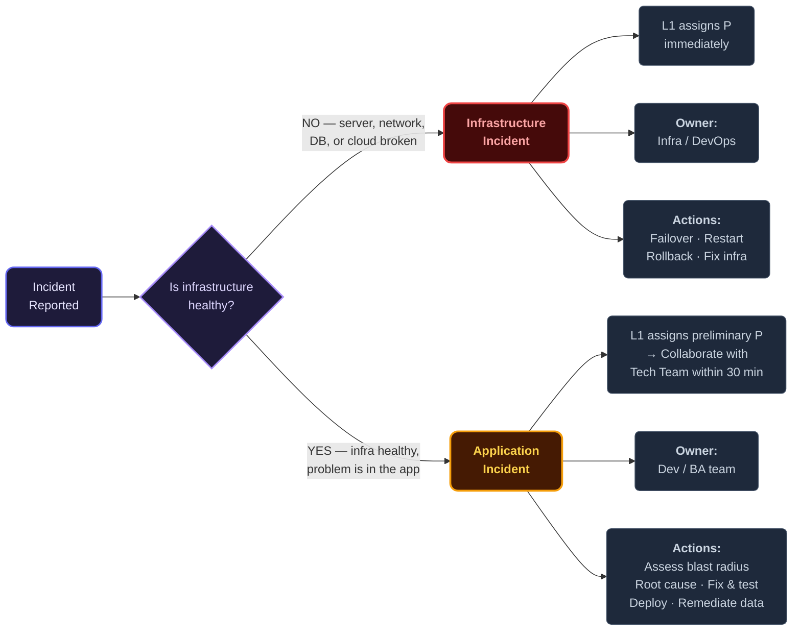
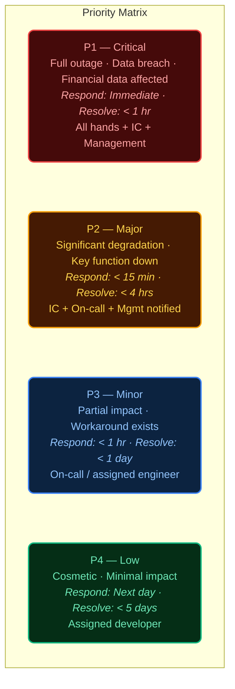

# IT Incident Management — Swimlane Flow

> Lean incident management process. Shows who does what at each stage.
> Designed for 1–2 slide presentation.
>
> Related: [`incident-triage-guideline.md`](incident-triage-guideline.md) · [`lightweight.md`](lightweight.md) · [`severity-triage.md`](severity-triage.md) · [`incident-knowledge-base.md`](incident-knowledge-base.md)

---

## Incident Classification

| Type | Definition | Owner | Examples |
|------|-----------|-------|---------|
| **Infrastructure Incident** | Platform layer is broken — servers, network, DB, cloud services. Application cannot run. | Infra / DevOps | Server crash, network outage, DB down, cloud service disruption, certificate expired |
| **Application Incident** | Infrastructure is healthy. Problem is at the application layer — crash, wrong output, logic error, design flaw. | Dev / BA team | App OOM, wrong calculation, missing info display, design flaw affecting all customers, data corruption |

**Key question**: Is infrastructure healthy? NO → Infra Incident. YES → Application Incident.

Both can be **any priority**. A silent design flaw miscalculating premiums for all customers = P1 Application Incident.

---

## Priority Matrix

| Priority | Name | Definition | Response Time | Resolution Target | Who's Involved |
|----------|------|-----------|---------------|-------------------|----------------|
| **P1** | Critical | Full outage, data breach, or financial data affected | Immediate | < 1 hour | All hands: IC + Tech + Mgmt + Comms |
| **P2** | Major | Significant degradation, key function unavailable | < 15 min | < 4 hours | IC + On-call team + Mgmt notified |
| **P3** | Minor | Partial impact, workaround available | < 1 hour | < 1 business day | On-call / assigned team |
| **P4** | Low | Cosmetic, minimal impact | Next business day | < 5 business days | Assigned developer |

---

## Swimlane Flow — Who Does What

### Slide Layout (6 Stages × 6 Roles)

```
 STAGE ▸       ① DETECT         ② TRIAGE            ②b COLLABORATE       ③ RESPOND & FIX      ④ VERIFY          ⑤ CLOSE
               (< 5 min)        (< 15 min)          (< 30 min, App only) (Priority-dependent)  (< 30 min)        (< 48 hrs)
─────────────┬────────────────┬───────────────────┬────────────────────┬──────────────────────┬─────────────────┬──────────────────
             │                │                   │                    │                      │                 │
 ANYONE      │ Report issue   │                   │                    │                      │                 │
 (User /     │ via channel    │                   │                    │                      │                 │
  Alert)     │ or alert fires │                   │                    │                      │                 │
             │                │                   │                    │                      │                 │
─────────────┼────────────────┼───────────────────┼────────────────────┼──────────────────────┼─────────────────┼──────────────────
             │                │                   │                    │                      │                 │
 L1/L2 ITO   │ Receive &      │ Confirm real?     │ App Incident:      │                      │                 │
 (On-call /  │ acknowledge    │ Check infra       │ Loop in Tech Team  │                      │                 │
  Help Desk) │                │ health            │ + BA within 30 min │                      │                 │
             │                │ Check Knowledge   │ Share preliminary P │                      │                 │
             │                │ Base for known    │                    │                      │                 │
             │                │ scenarios         │ Infra Incident:    │                      │                 │
             │                │ Classify: Infra   │ (skip — escalate   │                      │                 │
             │                │ or Application?   │  immediately)      │                      │                 │
             │                │ Assign P (or      │                    │                      │                 │
             │                │ preliminary P)    │                    │                      │                 │
             │                │                   │                    │                      │                 │
─────────────┼────────────────┼───────────────────┼────────────────────┼──────────────────────┼─────────────────┼──────────────────
             │                │                   │                    │                      │                 │
 INCIDENT    │                │ Assigned as IC    │                    │ Coordinate team      │ Confirm service │ Lead RCA meeting
 COMMANDER   │                │ (P1/P2 only)      │                    │ Manage comms         │ restored or fix │ Publish report
 (IC)        │                │                   │                    │ Decide: rollback?    │ deployed        │ Track actions
             │                │                   │                    │   escalate? war room?│                 │ Update Knowledge
             │                │                   │                    │                      │                 │ Base
             │                │                   │                    │                      │                 │
─────────────┼────────────────┼───────────────────┼────────────────────┼──────────────────────┼─────────────────┼──────────────────
             │                │                   │                    │                      │                 │
 TECH TEAM   │                │                   │ App Incident:      │ INFRA INCIDENT:      │ Monitor 15 min  │ Contribute to
 (Dev /      │                │                   │ Assess blast       │  → Rollback/restart/ │ for regression  │ RCA findings
  Infra /    │                │                   │ radius with L1     │    failover          │                 │
  BA / DBA)  │                │                   │ Confirm or         │  → Apply infra fix   │                 │
             │                │                   │ adjust P           │                      │                 │
             │                │                   │                    │ APP INCIDENT:        │                 │
             │                │                   │                    │  → Root cause        │                 │
             │                │                   │                    │  → Develop & test fix│                 │
             │                │                   │                    │  → Deploy via CI/CD  │                 │
             │                │                   │                    │  → Remediate bad data│                 │
             │                │                   │                    │                      │                 │
─────────────┼────────────────┼───────────────────┼────────────────────┼──────────────────────┼─────────────────┼──────────────────
             │                │                   │                    │                      │                 │
 QA          │                │                   │                    │                      │ Validate fix in │ Verify no
             │                │                   │                    │                      │ staging (App    │ regression
             │                │                   │                    │                      │ Incident only)  │
             │                │                   │                    │                      │                 │
─────────────┼────────────────┼───────────────────┼────────────────────┼──────────────────────┼─────────────────┼──────────────────
             │                │                   │                    │                      │                 │
 MANAGEMENT  │                │ Notified          │                    │ Receive status       │ Approve service │ Review RCA
 (IT Mgr /   │                │ (P1/P2)           │                    │ updates              │ restoration     │ Sign off
  CTO)       │                │ Approve           │                    │ (P1: every 30 min,   │                 │ action items
             │                │ escalation        │                    │  P2: every 1 hr)     │                 │
             │                │                   │                    │                      │                 │
─────────────┴────────────────┴───────────────────┴────────────────────┴──────────────────────┴─────────────────┴──────────────────
```

---

## RACI Matrix

| Stage | L1/L2 ITO | Incident Commander | Tech Team | QA | Management |
|-------|-----------|-------------------|-----------|-----|------------|
| ① Detect | **R** | I | I | — | — |
| ② Triage | **R/A** | **A** (P1/P2) | **C** | — | **I** (P1/P2) |
| ②b Collaborate (App Incident) | **R** | I | **R/A** | — | — |
| ③ Respond & Fix | I | **A** | **R** | **R** (App Incident) | **I** |
| ④ Verify | I | **A** | **R** | **R** | **I** |
| ⑤ Close (RCA) | — | **R** | **C** | **C** | **A** |

> **R** = Responsible · **A** = Accountable · **C** = Consulted · **I** = Informed

---

## Quick Reference — Infrastructure vs Application Incident

| | Infrastructure Incident | Application Incident |
|---|---|---|
| **Infra health** | Broken | Healthy |
| **Problem layer** | Server, network, DB, cloud | App code, logic, design, config, data |
| **Priority assignment** | L1 assigns directly (scope is clear) | L1 assigns preliminary P → Tech Team confirms within 30 min |
| **Response** | Restore immediately (rollback, restart, failover) | Assess blast radius → fix correctly → remediate data |
| **Owner** | Infra / DevOps | Dev / BA team |
| **Detection** | Loud — monitoring catches it | Often quiet — detected by people, not alerts |
| **RCA trigger** | Always for P1/P2 | Always for P1/P2 + if financial/data impact |

---

## Mermaid Diagrams

### Main Flow — Incident Management Process

```mermaid
flowchart TD
    %% ═══════════════════════════════════════
    %% STAGE 1: DETECT
    %% ═══════════════════════════════════════
    subgraph S1["① DETECT  •  < 5 min"]
        direction TB
        A1["Monitoring alert fires"]
        A2["User / stakeholder reports"]
        A3["Health check fails"]
    end

    %% ═══════════════════════════════════════
    %% STAGE 2: TRIAGE
    %% ═══════════════════════════════════════
    subgraph S2["② TRIAGE  •  < 15 min"]
        direction TB
        B1["<b>L1/L2 ITO</b><br/>Confirm incident is real"]
        B2["<b>L1/L2 ITO</b><br/>Check Knowledge Base"]
        B3["<b>L1/L2 ITO</b><br/>Is infra healthy?"]
        B1 --> B2 --> B3
    end

    A1 --> B1
    A2 --> B1
    A3 --> B1

    B3 --> FORK{"Infra healthy?"}

    %% ═══════════════════════════════════════
    %% INFRA INCIDENT PATH
    %% ═══════════════════════════════════════
    subgraph S3A["③ RESPOND — Infrastructure Incident"]
        direction TB
        C0["<b>L1</b> assigns P immediately"]
        C1["<b>Incident Commander</b><br/>Activate war room<br/>Coordinate response"]
        C2["<b>Infra / DevOps</b><br/>Rollback / Restart / Failover"]
        C3["<b>Infra / DevOps</b><br/>Apply infrastructure fix"]
        C4["<b>IC</b><br/>Status updates<br/>P1: 30 min · P2: 1 hr"]
        C0 --> C1 --> C2 --> C3
        C1 --> C4
    end

    %% ═══════════════════════════════════════
    %% APPLICATION INCIDENT PATH
    %% ═══════════════════════════════════════
    subgraph S3B["②b + ③ — Application Incident"]
        direction TB
        D0["<b>L1</b> assigns preliminary P"]
        D0B["<b>L1 + Tech Team + BA</b><br/>Collaborate within 30 min<br/>Assess blast radius<br/>Confirm / adjust P"]
        D1["<b>Incident Commander</b><br/>Coordinate response"]
        D2["<b>Dev Team</b><br/>Root cause & develop fix"]
        D3["<b>QA</b><br/>Validate fix in staging"]
        D4["<b>Dev / DBA</b><br/>Deploy & remediate data"]
        D0 --> D0B --> D1 --> D2 --> D3 --> D4
    end

    FORK -->|"NO — infra broken"| C0
    FORK -->|"YES — infra healthy"| D0

    %% ═══════════════════════════════════════
    %% STAGE 4: VERIFY
    %% ═══════════════════════════════════════
    subgraph S4["④ VERIFY  •  < 30 min"]
        direction TB
        E1["<b>Tech Team</b><br/>Monitor 15 min for regression"]
        E2["<b>QA</b><br/>Confirm fix correctness"]
        E3["<b>IC</b><br/>Confirm service restored"]
        E1 --> E3
        E2 --> E3
    end

    C3 --> E1
    D4 --> E1
    D4 --> E2

    %% ═══════════════════════════════════════
    %% STAGE 5: CLOSE
    %% ═══════════════════════════════════════
    subgraph S5["⑤ CLOSE  •  Within 48 hrs"]
        direction TB
        F1["<b>IC</b><br/>Lead blameless RCA"]
        F2["<b>Tech Team</b><br/>Identify root cause"]
        F3["<b>IC</b><br/>Define action items"]
        F4["<b>IC</b><br/>Update Knowledge Base"]
        F5["<b>Management</b><br/>Review & sign off"]
        F6["<b>INCIDENT CLOSED</b><br/>RCA published · Actions in backlog<br/>Knowledge Base updated"]
        F1 --> F2 --> F3 --> F4 --> F5 --> F6
    end

    E3 --> F1

    %% ═══════════════════════════════════════
    %% MANAGEMENT — parallel
    %% ═══════════════════════════════════════
    MGT["<b>Management</b><br/>Notified P1/P2<br/>Status updates"]

    B3 -. "P1/P2<br/>notification" .-> MGT
    C4 -. "status<br/>updates" .-> MGT
    E3 -. "all-clear" .-> MGT

    %% ═══════════════════════════════════════
    %% STYLES
    %% ═══════════════════════════════════════
    classDef stageDetect fill:#1E293B,stroke:#6366F1,stroke-width:2px,color:#E2E8F0
    classDef stageTriage fill:#1E293B,stroke:#8B5CF6,stroke-width:2px,color:#E2E8F0
    classDef stageInfra fill:#1C1917,stroke:#EF4444,stroke-width:2px,color:#FCA5A5
    classDef stageApp fill:#1C1917,stroke:#F59E0B,stroke-width:2px,color:#FDE68A
    classDef stageVerify fill:#1E293B,stroke:#10B981,stroke-width:2px,color:#A7F3D0
    classDef stageClose fill:#1E293B,stroke:#0EA5E9,stroke-width:2px,color:#BAE6FD
    classDef forkNode fill:#1E1B3A,stroke:#A78BFA,stroke-width:2.5px,color:#DDD6FE
    classDef mgtNode fill:#0C2340,stroke:#0EA5E9,stroke-width:1.5px,color:#BAE6FD,rx:8
    classDef doneNode fill:#052E16,stroke:#22C55E,stroke-width:2.5px,color:#BBF7D0,rx:12

    class S1 stageDetect
    class S2 stageTriage
    class S3A stageInfra
    class S3B stageApp
    class S4 stageVerify
    class S5 stageClose
    class FORK forkNode
    class MGT mgtNode
    class F6 doneNode
```



### Incident Classification Decision



### Priority Levels



---

## PPT Design Notes

- **Slide 1**: Swimlane flow. Horizontal lanes per role, left-to-right stages. Infra Incident path (red) vs Application Incident path (amber). Note the collaboration step (②b) in the App path.
- **Slide 2**: Priority matrix (color-coded) + RACI grid + Quick Reference comparison.
- **Colors**: P1 = Red, P2 = Orange, P3 = Blue, P4 = Green.
- **Font**: 14pt minimum for readability.
