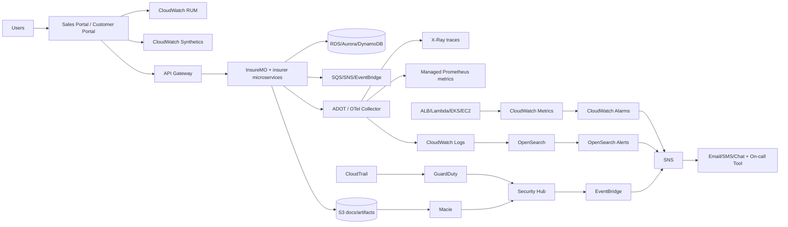

# Real-Time Monitoring and Alerting for a Vietnam Life Insurer on AWS in 2026

## Executive summary

A life insurer running eBaoTech InsureMO on entity["company","Amazon Web Services","cloud provider"] needs an observability program that treats “digital insurance journeys” (quote → underwriting/STP → policy issuance → premium collection → policy servicing/riders) as first-class monitored products, not just IT assets. Vietnam’s insurance law framework expects insurers’ IT systems to support reporting/supervision, fraud prevention, risk administration/control, inspection/supervision readiness, and uninterrupted operation (catastrophe response and business continuity). citeturn24view1turn25view0

In 2026, the biggest architecture constraint for “real-time monitoring” is that observability data itself can be regulated personal data (logs, traces, session metadata, canary artifacts). Vietnam’s Personal Data Protection Law requires (among other things) cross-border transfer impact assessment dossiers within 60 days of starting cross-border transfers; dossier updates (including periodic updates where changes occur); and notification to the competent authority within 72 hours for certain personal data protection violations. These requirements should directly shape logging/redaction, access controls, retention, and privacy-incident alerting. citeturn18view1turn18view2

A pragmatic target-state technical stack for this context is:

- **User experience**: CloudWatch RUM for real-user performance and client errors; CloudWatch Synthetics for scripted “critical journey” canaries. citeturn7search5turn7search13turn7search0turn7search4  
- **Traces + service maps**: AWS X-Ray plus standardized instrumentation via entity["organization","OpenTelemetry","observability framework"], delivered operationally using AWS Distro for OpenTelemetry (ADOT) on EKS/ECS/Lambda where applicable. citeturn28search0turn28search2turn13search1  
- **Metrics**: CloudWatch for AWS resource metrics and alarms; Amazon Managed Service for Prometheus (AMP) for high‑cardinality application + business telemetry. citeturn28search15turn7search19turn7search15  
- **Logs**: CloudWatch Logs as the default central log sink; OpenSearch for log analytics/SIEM-style workflows, fed by CloudWatch Logs streaming or Firehose. citeturn28search7turn12search16turn11search7  
- **Alert routing**: CloudWatch Alarms → SNS, with EventBridge for enrichment/automation and consistent escalation/runbooks. citeturn13search2turn13search6turn11search10  
- **Security/compliance**: CloudTrail + GuardDuty + Security Hub, plus Macie for sensitive-data detection in S3 (documents + observability artifacts). citeturn10search7turn10search8turn10search1turn10search2  

## Regulatory, privacy, and industry-specific monitoring requirements

Vietnam’s Law on Insurance Business (08/2022/QH15) explicitly frames insurance IT as a tool to improve efficiency across product design, risk assessment, contract conclusion/management, and claims; modernize statistical/reporting work; build IT systems and databases to support management/supervision and “prevention and control of insurance frauds.” It also requires insurers’ IT systems to facilitate risk administration/control and inspection/supervision by management agencies, and to have “information technology solutions to respond to catastrophes and ensure uninterrupted business activities.” citeturn24view1turn25view0  
Implication: monitoring must produce auditable evidence (availability, audit trails, incident history, controls) that can be presented during inspections and internal/external audits. The law does not prescribe a specific toolset in the sources reviewed; therefore, the monitoring requirements are “outcome-based” (e.g., demonstrable continuity, security, auditability). citeturn17view0turn24view1

Vietnam’s Personal Data Protection Law (91/2025/QH15) has direct operational impacts for observability: (a) cross-border transfer is broadly defined (including using offshore platforms to process personal data collected in Vietnam); (b) an impact assessment dossier must be prepared and submitted within 60 days from first cross-border transfer; (c) dossiers must be updated (including periodic updates when changes occur); and (d) notification to the personal data protection authority is required within 72 hours after detecting certain personal data protection violations likely to cause serious harms. The law also states that insurance business applications must comply with personal data protection, and that consent is required for personal data collection/processing in insurance business activities (subject to limited exceptions). citeturn18view1turn18view2turn18view0  
Implication: implement “privacy incident” alerts (PII leakage into logs/traces, unexpected exports, anomalous access patterns) and ensure evidence capture supports the 72-hour notification window where applicable. citeturn18view2turn28search7turn10search7

Cybersecurity/data locality constraints can also influence monitoring placement. Decree 53/2022/ND-CP (implementing the Cybersecurity Law) is widely treated as strengthening cybersecurity/data localization enforceability; scope depends on legal classification. Architect monitoring so it can support audit of access, rapid incident response, and—if required—data locality controls (including knowing where logs/traces are stored/processed). citeturn8search6turn8search2turn18view1  
Operational note: AWS lists an AWS Local Zone location for entity["city","Hanoi","Vietnam"], attached to the Asia Pacific (entity["city","Singapore","Singapore"]) parent region. This may help latency and some locality objectives, but it is not the same as a full in-country AWS region; cross-border transfer considerations may still apply for core workloads/data. citeturn9search2turn9search4turn18view1

AML and fraud monitoring should be treated as “production telemetry,” not only periodic reporting. Vietnam’s AML law entered into force 1 March 2023; guidance materials highlight that suspicious signs exist for life insurance, so detection logic should include premium/payment anomalies, early surrender patterns, unusual beneficiary/ownership changes, and agent/channel anomalies. citeturn26view0turn8search0turn25view0

## End-to-end system inventory and data flows

The insurer’s functional inventory (based on the user’s context and typical AWS deployments) should include these domains and flows:

- **Channels**: sales portal (agents/banca/direct), customer portal (self‑service).  
- **Access + API front door**: CDN/WAF/ALB/API gateway, authentication/authorization.  
- **Core platform**: InsureMO modules + insurer-built microservices for underwriting, STP, policy admin, billing, rider processing. Vendor materials describe InsureMO on AWS as a microservices-enabled platform and eBaoCloud as providing API gateway functions with logging and dashboards (response time, success/failure hits, segmented by API publisher/consumer). citeturn14view0turn14view1turn16view1turn16view2turn16view3  
- **Data layer**: RDS/Aurora (policy/application), DynamoDB (high‑scale key/value or session), ElastiCache (caching), S3 (documents, artifacts). citeturn21search2turn21search14turn22search8turn22search1turn22search7  
- **Async + integrations**: SQS/SNS/EventBridge for decoupling; partner integrations (KYC/IDV, payments/banks, reinsurers, SMS/email). Queue depth/age metrics and DLQ patterns are critical to prevent “silent backlog” failures. citeturn21search3turn21search7turn11search10turn13search6  
- **Security telemetry**: CloudTrail, GuardDuty, Security Hub, WAF logs, VPC Flow Logs, Macie (S3). citeturn10search7turn10search8turn10search1turn23search7turn23search0turn10search2  

A minimum set of “end-to-end traced journeys” to define and instrument:

1) Quote → submit application → underwriting/STP → policy issuance confirmation.  
2) Customer login → view policy → rider add/remove → confirmation.  
3) Billing cycle → payment authorization → posting + reconciliation confirmation.  
4) Partner/banca API → insurer decision/issuance response (per-partner SLA view). citeturn16view2turn7search0turn7search5

## Persona-based metrics, KPIs, SLOs, SLIs, and user-experience indicators

### Core measurement model

Define SLIs as precise quantitative indicators and SLOs as targets over time windows (e.g., 30 days). This model is strongly recommended in entity["book","Site Reliability Engineering","google sre book"] guidance (SRE book/workbook) and is effective for controlling alert fatigue using burn-rate/error budgets rather than raw thresholds. citeturn20search0turn20search1turn27search0

### Persona requirements table

| Persona | What they need in real time | Required indicators | Example SLO/targets (seed values) |
|---|---|---|---|
| End customer | “Can I complete my task now?” | RUM Apdex, page load p75/p95, client JS errors, transaction success, canary pass rate | Login success ≥99.9% / 30d; pay‑premium success ≥99.5% / 30d citeturn7search9turn7search5turn7search0 |
| Sales/agent | “Can I quote/submit reliably?” | Quote latency, illustration time, submit success, throttling/auth failures, partner API error rate | Quote success ≥99.5% / 30d; partner API availability per contract citeturn16view2turn16view3 |
| OPS/SRE | “Which service is degrading and why?” | Four golden signals (latency/traffic/errors/saturation), deployment overlays, dependency health | Service SLOs + burn‑rate alerts (multi-window) citeturn27search0turn20search1 |
| Underwriting | “Backlog risk and SLA breach risk” | Case backlog by age bucket, median/p95 decision time, evidence request rate, STP/manual split | Decision SLA (e.g., X hours for Y% cases); backlog guardrails citeturn19search21turn24view1 |
| Fraud/AML/compliance | “What looks suspicious?” | KYC failure spikes, unusual payment/surrender patterns, anomalous agent activity, audit-log coverage | Triage SLA; detection quality KPIs (precision/recall) citeturn26view0turn8search0turn10search7 |
| Business analysts | “Are we on track?” | Funnel conversion, issuance cycle time, premium success, rider attach/detach success | KPI thresholds + anomaly detection baselines citeturn11search1turn14view0 |

### Required technical metrics (AWS + insurance processes)

Use CloudWatch’s built-in AWS resource metrics and establish best-practice alarms for core services (ALB 4xx/5xx and latency; Lambda errors/throttles/concurrency; RDS/Aurora health and replication lag; SQS age/depth; DynamoDB consumed capacity and throttling; ElastiCache evictions and CPU/memory). citeturn21search4turn21search5turn21search10turn21search7turn22search8turn22search1turn21search8turn21search11  
For process telemetry, add business metrics: STP rate (automation fraction), issuance time distributions, premium collection success and lag, rider processing success/time. Industry definitions of STP emphasize end-to-end automation without manual intervention, so “STP rate” can be treated as a KPI/SLI. citeturn19search5turn19search21

## Monitoring types, observability architecture, and alert flow

### Monitoring types to implement

- **Synthetic**: CloudWatch Synthetics canaries for scripted journeys and API checks; persist artifacts to S3 for incident triage. citeturn7search0turn7search4turn7search8  
- **Real-user monitoring**: CloudWatch RUM for page performance, sessions, client errors, Apdex. citeturn7search5turn7search13turn7search9  
- **Distributed tracing**: X-Ray plus OpenTelemetry (OTel) instrumentation; ADOT Operator/Collector to send metrics/traces to multiple monitoring backends (CloudWatch, Prometheus/AMP, X-Ray). citeturn13search1turn28search0turn28search2turn7search15  
- **Logs**: CloudWatch Logs centralization plus Logs Insights and metric filters; stream to OpenSearch for log analytics/security analytics. citeturn28search7turn11search0turn28search3turn12search16  
- **Events**: EventBridge rules/targets for routing operational and security events and enabling enrichment/automation. citeturn11search10turn11search2  
- **Anomaly detection / baselining**: CloudWatch anomaly detection for seasonality (traffic, conversion). citeturn11search1turn11search17

### Proposed AWS monitoring architecture and InsureMO instrumentation approach

Instrument once (OTel) and route to multiple stores: CloudWatch for baseline resource metrics and alarms; AMP for high-cardinality metrics; X-Ray for traces; CloudWatch Logs/OpenSearch for logs. OTel context propagation uses W3C Trace Context by default, enabling consistent correlation across services and network boundaries when implemented correctly. citeturn28search1turn28search0turn13search1  
For InsureMO specifically, start by integrating native API telemetry from the eBao gateway/dashboard layer (where available: authentication/routing/rate limit/circuit break/logging; dashboardable response time and success/failed hits). Then add OTel tracing at the insurer-owned edge/gateway and microservices boundaries, with strict PII redaction and stable business correlation IDs (policy/application IDs tokenized) to support underwriting/fraud investigations without leaking personal data into logs. citeturn16view1turn16view2turn16view3turn18view0turn28search7  

### Mermaid diagram for data and alert flow



(Components reflect AWS-documented capabilities for RUM/Synthetics, ADOT routing, CloudWatch alarms→SNS, Firehose/log streaming patterns, EventBridge, and AWS security services.) citeturn7search5turn7search0turn28search2turn13search2turn13search6turn11search10turn10search7turn10search8turn10search2turn10search1

## Alerting, escalation, runbooks, dashboards, and implementation pack

### Alerting strategy

Use three alert types:

1) **Hard thresholds** for capacity and correctness (queue age, DB replication lag, payment failure spikes). CloudWatch Alarms can notify through SNS actions. citeturn13search2turn13search6turn21search10turn21search7  
2) **Anomaly alerts** for seasonal metrics (traffic, conversion). citeturn11search1turn11search17  
3) **SLO burn-rate alerts** for customer-facing services to reduce alert fatigue; the SRE workbook describes burn-rate and multi-window approaches. citeturn20search1turn20search0  

Escalation should be explicit (primary → secondary → incident commander). PagerDuty’s docs describe escalation policies as the mechanism that escalates until acknowledged (conceptually applicable even if using other tools). citeturn20search2turn20search6  
Notification channels typically include email/SMS and chat-based collaboration; for example, Opsgenie provides guidance for integrating with Microsoft Teams. citeturn20search19turn20search3

### Security & compliance alerts

Minimum security alert families:

- IAM anomalies and suspicious API calls (CloudTrail + GuardDuty + Security Hub). citeturn10search7turn10search8turn10search1  
- Data exfiltration indicators and sensitive-data exposure risk (Macie on S3, plus unusual access patterns). citeturn10search2turn10search18turn18view2  
- WAF spikes (credential stuffing, injection attempts) with logs deliverable to CloudWatch Logs/S3/Firehose. citeturn23search7turn23search3  
- Network threat hunting signals using VPC Flow Logs (published to CloudWatch Logs/S3/Firehose). citeturn23search0turn23search12  

These must connect to privacy incident workflows because the Personal Data Protection Law imposes a 72-hour notification requirement for certain personal data protection violations. citeturn18view2

### Dashboard templates and widget comparison

Use Amazon Managed Grafana as the primary dashboard layer because it integrates with CloudWatch, AMP, OpenSearch, and X-Ray. citeturn12search2turn12search3turn12search14

| Dashboard | Persona | Key widgets | Primary data sources |
|---|---|---|---|
| Digital Experience | customer + OPS | Apdex, p95 page load, JS errors, canary pass rate | RUM + Synthetics + X-Ray citeturn7search9turn7search0turn13search0 |
| New Business Funnel | sales/agent | quote latency, submit success, funnel drop-off, per-partner SLA | business metrics (AMP) + gateway metrics citeturn7search19turn16view2 |
| Underwriting & STP | underwriting | STP rate, backlog age buckets, decision time p95 | business metrics + queues + traces citeturn19search5turn21search7 |
| Platform Health | SRE/OPS | golden signals, DB health/ReplicaLag, queue age | CloudWatch + X-Ray + RDS/SQS citeturn27search0turn21search10turn21search7 |
| Security & Privacy | security/compliance | GuardDuty findings, Macie findings, WAF blocks, flow anomalies | CloudTrail/GuardDuty/Security Hub/Macie/WAF/Flow Logs citeturn10search7turn10search8turn10search2turn23search0turn23search7 |

### Prioritized roadmap, testing plan, and sample alerts/runbooks

**Roadmap (MVP → advanced)**  
MVP (8–12 weeks): central logs (CloudWatch Logs), core AWS metrics + recommended alarms, top 5 synthetic canaries, RUM on both portals, SNS-based notification routing, initial runbooks. citeturn28search7turn21search8turn7search0turn7search5turn13search2turn13search6  
Phase 2 (next 8–12 weeks): OTel/ADOT rollout; AMP workspace; X-Ray service maps; business telemetry for STP/issuance/billing/riders; first SLOs + burn-rate alerts. citeturn28search2turn7search15turn13search1turn20search1  
Phase 3 (next 6–10 weeks): security telemetry integrations (CloudTrail/GuardDuty/Security Hub/Macie/WAF logs), privacy incident workflows aligned to 72-hour notification requirements. citeturn10search7turn10search8turn10search1turn10search2turn18view2turn23search7  
Advanced: anomaly detection baselining, EventBridge automation, recurring reliability reviews tied to error budgets. citeturn11search1turn11search10turn20search1  

**Testing plan**  
Test canaries (fail on demand), routing drills (escalation), trace completeness tests, load tests for quote/issue journeys, and security simulations (seed CloudTrail anomalies and verify GuardDuty/Security Hub flows). Include privacy tabletop exercises for the 72-hour clock. citeturn7search0turn13search2turn13search1turn10search8turn10search1turn18view2

**Sample alert definitions (illustrative)**

```yaml
# 1) Customer journey failure (synthetic)
alert: JourneyCheckoutFailure
source: CloudWatchSynthetics
condition: "canary_success_rate < 0.98 for 10m"
severity: P1
notify: ["oncall", "digital-channel-leads"]
runbook: RB-DIGI-001
```

```yaml
# 2) STP rate drop (business metric in Prometheus/AMP)
alert: STPRateDrop
expr: (stp_success_total / stp_total) < 0.85
for: 15m
labels:
  severity: P2
annotations:
  summary: "STP success rate degraded (check rules/partner dependencies)"
```

```yaml
# 3) Underwriting backlog breach (queue age)
alert: UnderwritingQueueAgeHigh
source: SQS
metric: ApproximateAgeOfOldestMessage
condition: "> 1800 seconds for 10m"
severity: P1
runbook: RB-UW-002
```

```yaml
# 4) Database replication lag (RDS read replica)
alert: RDSReplicaLagHigh
metric: ReplicaLag
condition: "> 30s for 5m"
severity: P1
runbook: RB-DB-003
```

(These reflect AWS-documented Synthetics, SQS metrics including oldest message age, and RDS ReplicaLag semantics.) citeturn7search0turn21search7turn21search3turn21search10

**Runbook snippet examples (condensed)**

```text
RB-DIGI-001: Customer journey failing (quote/submit/payment)

1) Confirm impact:
   - Check Synthetics failure details + artifact in S3
   - Check RUM: sessions with errors, spike in JS errors, Apdex drop
2) Locate failing hop:
   - Trace the transaction in X-Ray service map
   - Identify top failing downstream dependency (auth, underwriting, billing)
3) Mitigate:
   - If dependency down: enable circuit breaker / fallback journey
   - If recent deploy: rollback or disable feature flag
4) Communicate:
   - Update status page/internal comms and open incident bridge
5) Post-incident:
   - Add regression test to canary; update SLO and alert thresholds
```

```text
RB-DB-003: RDS replication lag high

1) Verify ReplicaLag trend and DB connections/CPU.
2) Check slow queries / write bursts / long transactions.
3) Scale read replica or tune workload; consider failover if lag threatens SLO.
4) Capture evidence (metrics + logs) for audit trail and incident review.
```

(X-Ray service maps and CloudWatch RUM/Synthetics integration are AWS-documented; RUM provides sessions/errors/Apdex views.) citeturn13search1turn7search9turn7search0turn21search2turn21search10

### Key sources consulted

- Vietnam insurance and governance: Law on Insurance Business 08/2022/QH15; Circular 70/2022/TT-BTC (risk management/internal control). citeturn24view1turn17view0  
- Vietnam privacy: Personal Data Protection Law 91/2025/QH15; Decree 356/2025/ND-CP; 72-hour notifications and cross-border transfer impact assessment requirements. citeturn18view1turn18view2turn3view2  
- Vietnam AML: Law 14/2022/QH15 entry into force; entity["company","PwC","professional services firm"] overview highlighting suspicious signs for life insurance. citeturn26view0turn8search0  
- eBao/InsureMO references: AWS solution brief for InsureMO on AWS; eBaoCloud API gateway dashboard/logging slides. citeturn14view0turn14view1turn16view1turn16view2  
- AWS observability and security docs: CloudWatch (metrics/logs/alarms/recommended alarms/anomaly detection), RUM, Synthetics; ADOT/OTel; X-Ray; AMP; Managed Grafana; OpenSearch integration; EventBridge, SNS/SQS; VPC Flow Logs; WAF logging; CloudTrail, GuardDuty, Security Hub, Macie. citeturn28search15turn28search7turn7search5turn7search0turn28search2turn13search1turn7search19turn12search2turn12search16turn11search10turn13search6turn23search0turn23search7turn10search7turn10search8turn10search1turn10search2  
- SRE best practice: SLI/SLO definitions, golden signals, and burn-rate alerting guidance from Google SRE materials. citeturn20search0turn27search0turn20search1